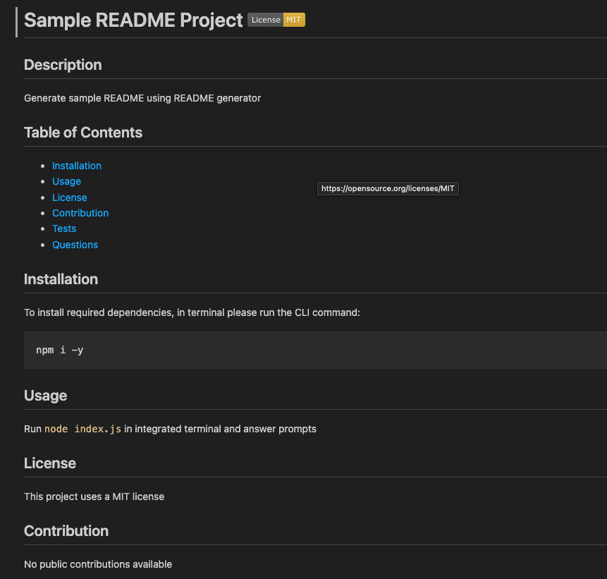

# Professional README Generator ⚙️

## Description
The purpose of this project is to create a professional README Generator that creates a README following a user answering a series of prompts using node JS.

## Requirements
- Ensure README consisting of Description, Table of Contents, Installation, Usage, License, Contributing, Tests, and Questions is generated following prompting of information about application repository
- Ensure README title is displayed when project title is entered
- Ensure Description, Installation, Usage, Contributing, and Tests displayed in README when description, installation instructions, usage information, contribution guidelines, and test instructions entered
- Ensure license badge added to top of README and section for License is added to README when license is selected from list of options
- Ensure link to GitHub profile is added to Questions section when GitHub username is entered
- Ensure email is added to Questions section when email address is entered
- Ensure clicking on links in Table of Contents takes user to corresponding section of README

## Node Application Preview

## Submission Requirements
- [Video Walkthrough](https://ajayshans.github.io/weather-dashboard-app/)
- [Sample README](https://github.com/ajayshans/README-generator/blob/main/sample/README-sample.md/)
- [GitHub Repo](https://github.com/ajayshans/README-generator/)